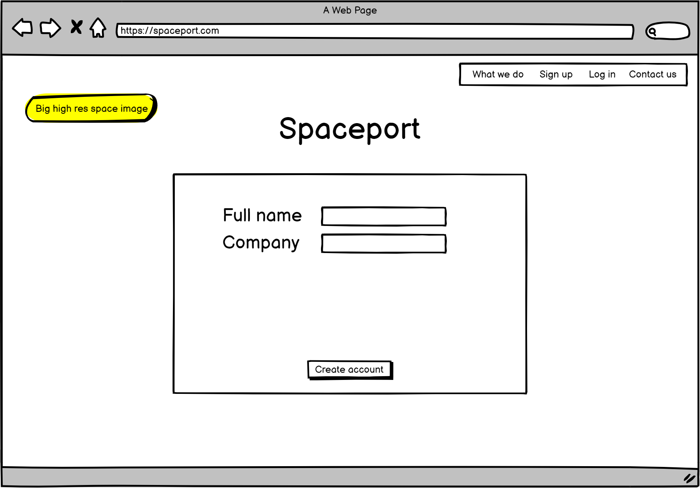
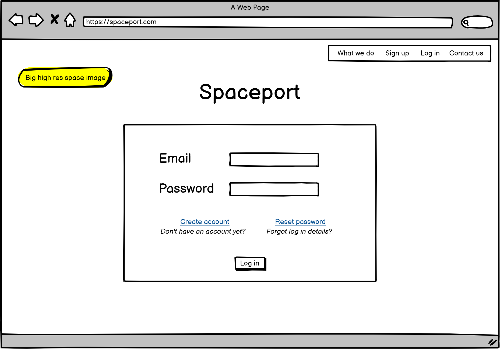
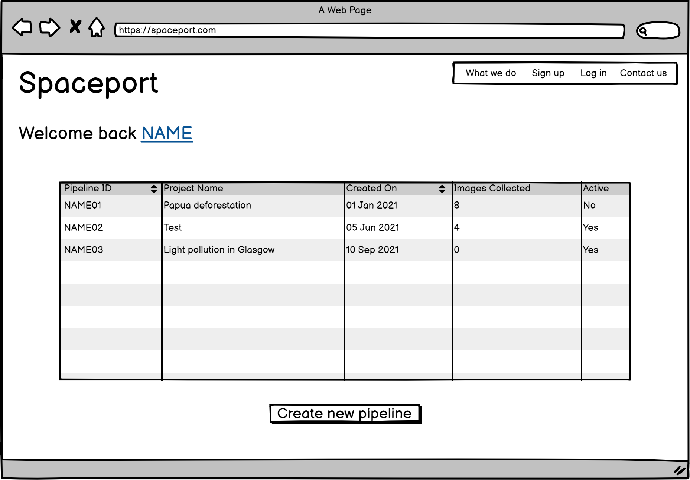
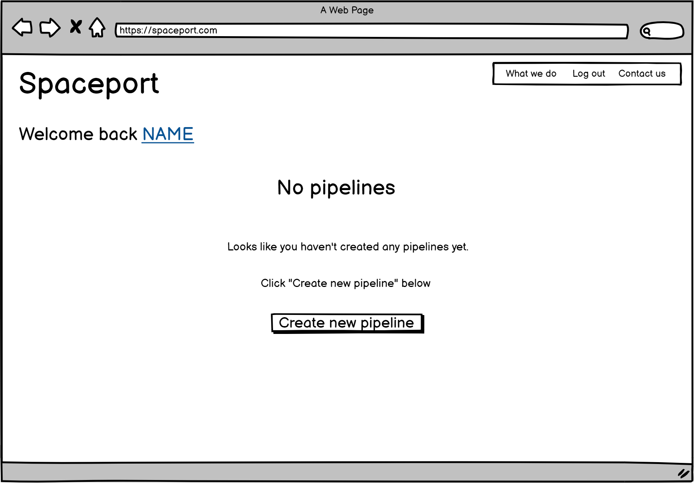
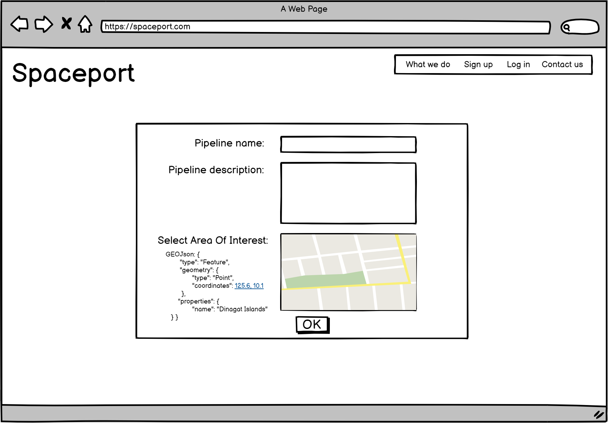
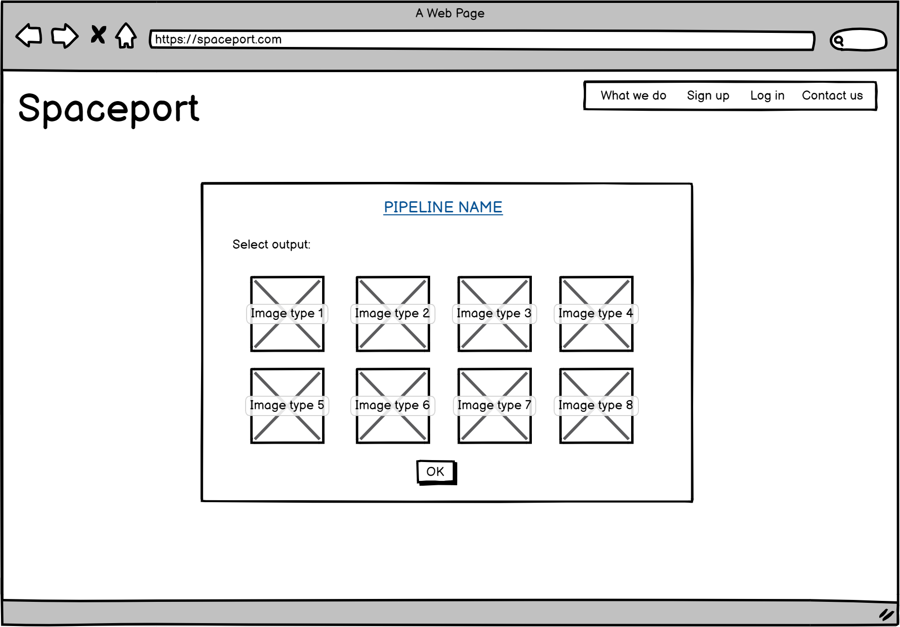
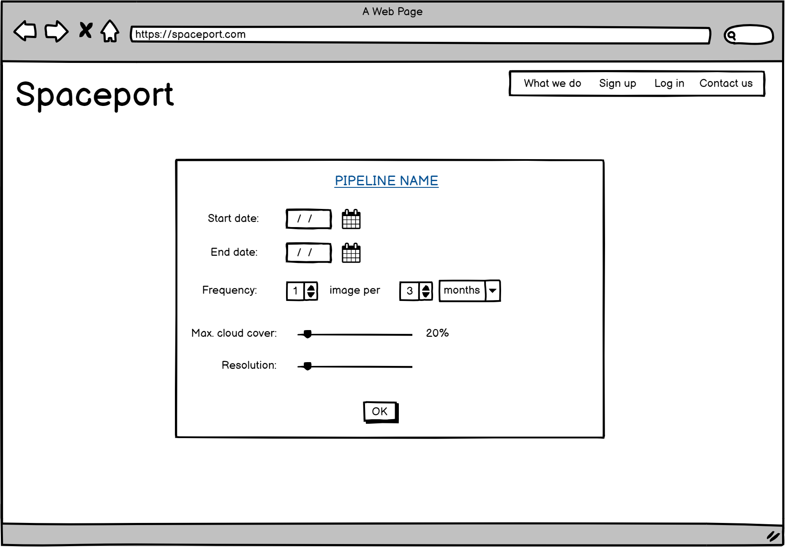
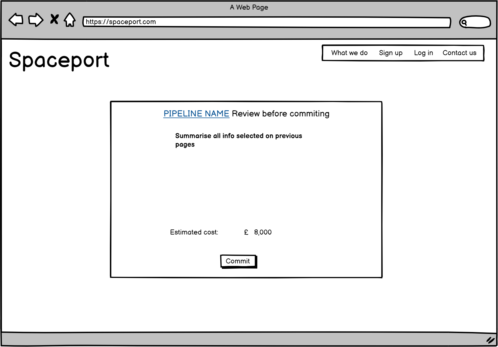
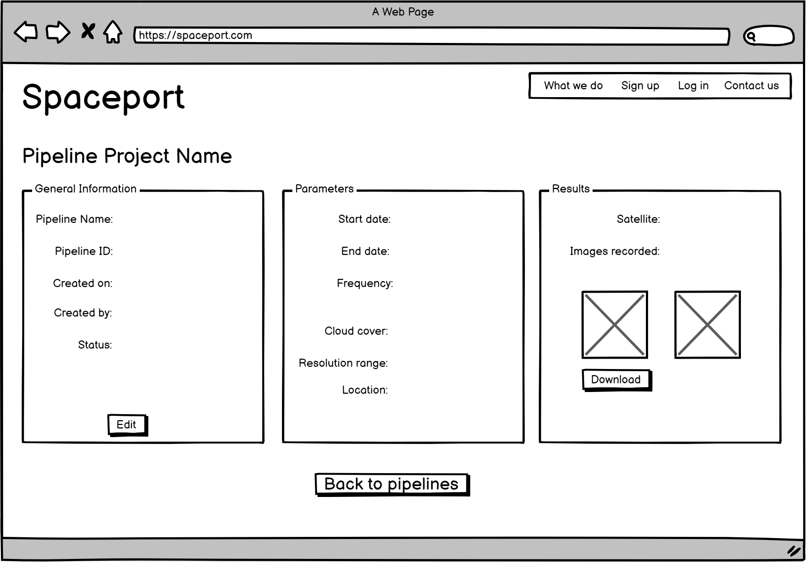

#  Spaceport App - project plan

The purpose of the site is to provide users with a platform to access high resolution satellite images of specified Areas of Interest (AOI).  The user can log on and create a tasking pipeline, input parameters of the images they would like to access and commit these to the pipeline.  The user can check the status of the pipeline at any time and download images. 

The website will access an external API called [Skywatch](https://www.skywatch.com/satellite-imagery-api) which will fetch the images and metadata once the parameters have been input and the pipeline has been committed.  

Example case:
An infrastructure company may want to use satellite imagery to monitor vegetation growth near electricity lines, fallen trees on train tracks, or people digging too close to pipelines. They could set up a pipeline to capture images which cover the length of the train track, recording data once a month. They can easily and efficiently identify potential issues or risks and notify their clients.

Other examples of the benefits of satellite imagery:
* detecting wildfires
* detecting illegal deforestation
* monitoring fields and increasing crop yield
* track progress on construction sites
* verify insurance claims by taking images before and after incidents

## Table of Contents

  * [Features](#features)
  * [UX](#ux)
    + [User Stories](#user-stories)
  * [Wireframes](#wireframes)
    + [API](#api)
  * [Models](#models)

## Features

### Landing Page
 

### Create account/log in 
If new to the site, the user can create an account:

Or if a returning user, they can sign in with their sign in credentials:

### User account - pipelines overview
Once logged in, the user can see current pipelines on their landing page.  These can be selected which directs them to details about the pipeline.

Or if the user has not got any pipelines created yet

### User account - create pipeline
The user is directed to an initial page and prompted to create a name for the new pipeline, as well as defining the main parameter which is the Area of Interest (AOI). This should be a GEOJson selector/API. 

The user can then select the desired output (type of image fetched by the satellite).

The user can then refine technical parameters, and the tasking schedule (ie start and end date, frequency of images fetched).

The user then has a chance to review all the information they selected before committing to tasking the pipeline and purchasing the data. 

### User account - pipeline detail
For already created pipelines, the user has a chance to view and interrogate the status of the pipeline, and download images fetched. 

## UX
### User Stories
- As a Site User, I can register an account so that I can create tasking pipelines to download the satellite images I need
- As a Site User, I can log in to my account so that I can check on the status of pipelines I previously created
- As a Site User, I can edit and delete pipelines I created, so that I can readjust the pipeline to fit my changing business model
- As a Site User, I can download images captured by my pipelines so that I can use these images for post production
- As a Site User, I can review the details of the pipeline I just created before committing, so that I can re-adjust the parameters if required
- As a Site User, I can review the estimated cost of the pipeline I just created before committing, so that I can expect this deduction from my account and plan for this financially
- As a Site User, I can upload my Area of Interest (AOI) in a variety of different formats, so that I can choose the format which suits my business best

- As a Site Admin, I can select and lock parameters such that the user cannot change them when generating a pipeline
- As a Site Admin, I can set a maximum budget per aquisition/pipeline/month/user such that my clients cannot overspend
- As a Site Admin, I can see an overview of all current active pipelines such that I know the current and future workload
- As a Site Admin, I can see an overview of all users/clients such that I know who is using the site

## Models

**users collection**

| Key      	| Value          	| Data Type 	|
|----------	|----------------	|-----------	|
| _id      	| ObjectId("ID") 	| ObjectId  	|
| email    	| "<email>"      	| EmailField    |
| password 	| "<password>"   	| string    	|
| company 	| user's company name   	| string    	|

**pipelines collection**

| Key            	| Value                                    	| Data Type 	      |  Example
|----------------	|------------------------------------------	|-----------	      | ----------
| pipeline_id       | unique identifier for this pipeline       | CharField (FK) 	  | USER001
| pipeline_name     | user's given name for pipeline            | CharField (PK) 	  | My First Pipeline
| pipeline_des      | user's given description                  | TextField     	  | Testing pipeline
| created_by        | user                           	        | CharField (FK)           | lucy_ci_01
| status       	    | pipeline active/not active                | Boolean    	      | True
| AOI        	    | area of interest: location co-ordinates   | JSONField           | *
| start_date    	| when pipeline starts 	                    | DateField    	      | 01/01/2021
| end_date 	        | when pipeline ends               	        | DateField or Null   | 31/12/2021
| frequency     	| how frequently images are captured        | DurationField   	  | 30 days
| cloud_cover 	    | % cloud cover allowed max                	| String    	      | 20
| resolution 	    | picture resolution range                  | string    	      | 7680 × 6876
| output_format     | image format                    	        | string    	      | GEOTiff

*[GeoJSON format](http://geojson.io/#map=9/41.2561/-3.5458)

**pipeline results**

| Key            	| Value                                    	| Data Type 	      |  Example
|----------------	|------------------------------------------	|-----------	      | ----------
| result_id         | unique identifier for this result         | CharField (PK)      | res_USER001
| pipeline_id       | which pipeline this result is for         | CharField (FK) 	  | USER001
| image             | the resulting image                       | ImageField     	  | res01.png
| date_created      | date image was created                    | DateTimeField       | 04/08/2021 15:22
| date_downloaded   | date image was downloaded                 | DateTimeField    	  | 14/10/2021 18:05
| image_size        | file size of image                        | String           	  | 50 MB
| image_res         | resolution of image                       | String           	  | 7680 × 6876
| satellite_name    | satellite used to take image              | String           	  | Sentinel-2A
| cloud_cover       | percentage cloud cover in image           | String           	  | 15.8

## Questions for Mo

# API
* Best way to access the API?
* Use JS to grab data from API, then use View to send to the model
* When to trigger request from API

# Create dynamic form
* The form to create a pipeline is over several pages
* Only want to change the 'div' in the middle, keep background the same

# Admin can lock parameters
# Where to start
# Send images from API to AWS to store, how to link to website?

# VIEWS

# -- PostPipelineList --
# list all pipelines for that user account on user account landing page

# get pipeline model from .models.py
# ordered by status, or most recently updated
# filter by if the user_id matches the user who is logged in
# ListView?

# -- PostPipelineDetail -- 
# list out details of this specific pipeline when the pipeline is selected

# get pipeline model from .models.py
# get pipeline results model from .models.py

# First Step
# is to send basic data from HTML to models (ie the parameters) 
# then from HTML to API back to models (ie the results)
# then print the results in HTML

